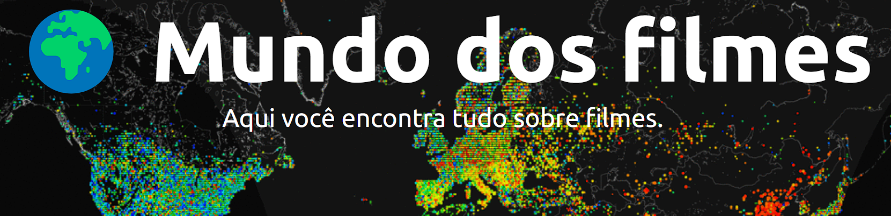
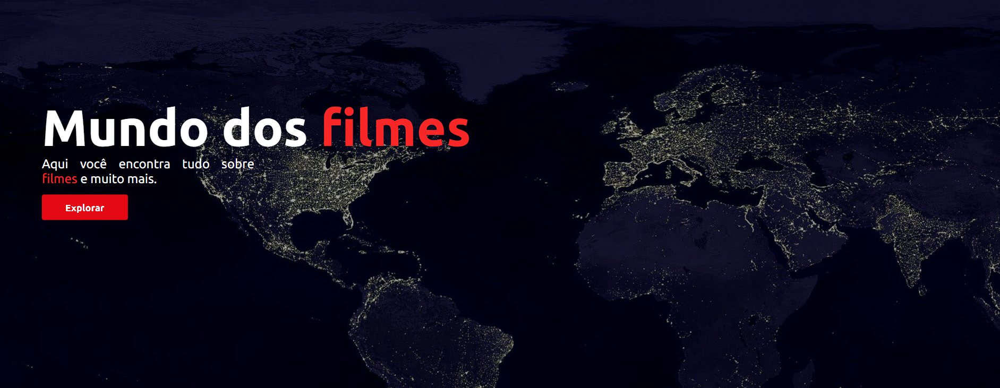
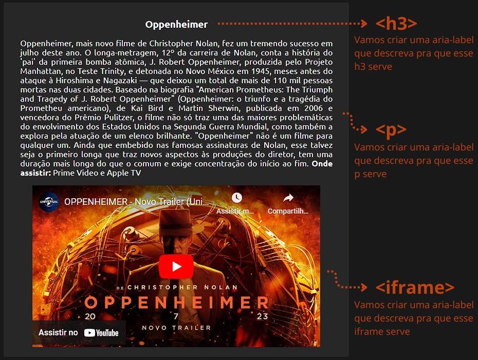
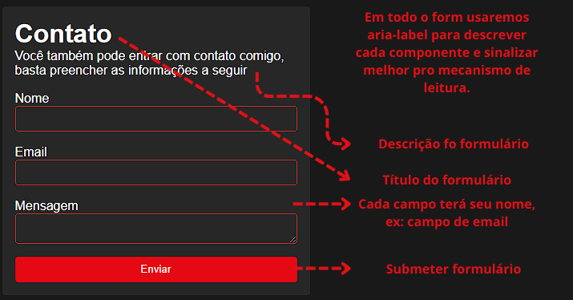
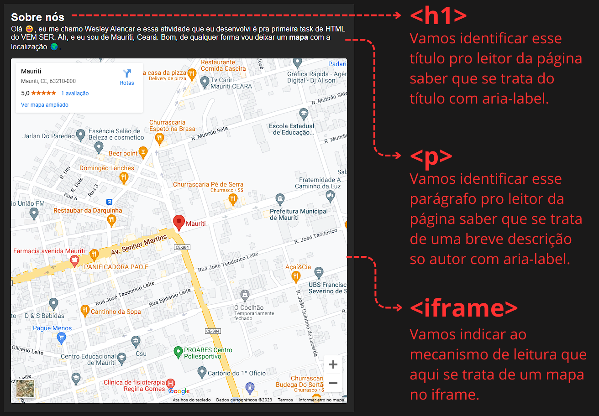
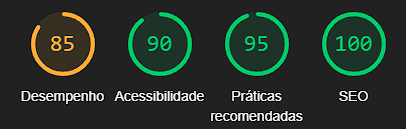

<h1 align="center">Detalhes do upgrad de desempenho e acessibildade</h1>

  Creio que o maior desafio aqui foi trabalhar com a imagem, já que a única imagem que eu usei foi pelo css com background-image. 

## 🚀 Ganhos de performace

Temos agora 4 tamanhos de imagem do mapa, 600px, hd, full hd e 2k:

> Antes
> 

> Depois
> 

## 🦻 Ganhos de acessibilidade

### 🏠 Da página inicial

> Exemplo de aria tag -> aria-label="Trailer do filme (Oppenheimer)"
>  

### 📝 Da página de contato

> Exemplo de aria tag -> aria-label="Título do formulário (Contato)"
> 

### 📝 Da página de sobre nós

> Exemplo de aria tag -> aria-label="Título da página (Sobre nós)"
> 

## 📈 Resultados

Por fim, vou deixar uma imagem com algumas métricas bem gerais sobre o site

> 

> <strong>Nota Importante</strong>   `Se você inspecionar a página, perceberá que haverão muitas requisições, creio que isso seja derivado dos iframes.`
